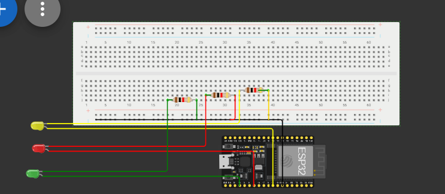

# Projeto Semáforo - ESP32

## Descrição




Este projeto simula um semáforo real usando ESP32 e MicroPython. O sistema controla 3 LEDs (verde, amarelo e vermelho) seguindo a sequência temporal de um semáforo de trânsito.

## Componentes Necessários
- 1x ESP32
- 1x LED Verde
- 1x LED Amarelo  
- 1x LED Vermelho
- 3x Resistores 220Ω ou 330Ω
- 1x Protoboard
- Jumpers para conexão
- Cabo USB para programação

## Esquema de Ligação

### Conexões dos Pinos:
- **LED Verde**: Pino 15 → Resistor → LED → GND
- **LED Amarelo**: Pino 18 → Resistor → LED → GND  
- **LED Vermelho**: Pino 4 → Resistor → LED → GND

### Montagem na Protoboard:
1. Conecte o ânodo (+) de cada LED ao resistor correspondente
2. Conecte os resistores aos pinos digitais do ESP32
3. Conecte todos os cátodos (-) dos LEDs ao GND do ESP32

## Temporização do Semáforo

| Cor | Tempo Ligado | Intervalo | Significado |
|-----|--------------|-----------|-------------|
| Verde | 20 segundos | 0.5s | Siga/Passe |
| Amarelo | 10 segundos | 0.5s | Atenção |
| Vermelho | 7 segundos | 0.5s | Pare |

**Ciclo Total**: 37.5 segundos por volta completa

## Como Usar

### 1. Preparação do Ambiente
- Instale o MicroPython no ESP32
- Configure sua IDE (Thonny, VS Code, etc.)

### 2. Upload do Código
- Copie o código para o arquivo `main.py`
- Faça upload para o ESP32

### 3. Execução
- O programa inicia automaticamente ao ligar o ESP32
- O semáforo seguirá o ciclo continuamente

## Código Principal

```python
from machine import Pin
from utime import sleep 

print("PROGRAMA DE SEMAFORO DO RAEL")

ledVerde = Pin(15, Pin.OUT)
ledAmarelo = Pin(18, Pin.OUT)
ledVermelho = Pin(4, Pin.OUT)

while True :
    ledVerde.on()
    sleep(20)
    ledVerde.off()
    sleep(0.5)

    ledAmarelo.on()
    sleep(10)
    ledAmarelo.off()
    sleep(0.5)

    ledVermelho.on()
    sleep(7)
    ledVermelho.off()
    sleep(0.5)
```

## Personalização

### Alterar Tempos
Modifique os valores em `sleep()` para ajustar a duração de cada fase:
```python
sleep(20)  # Tempo do verde em segundos
sleep(10)  # Tempo do amarelo em segundos  
sleep(7)   # Tempo do vermelho em segundos
```

### Alterar Pinos
Mude os números dos pinos conforme sua montagem:
```python
ledVerde = Pin(NOVO_PINO, Pin.OUT)
```

## Troubleshooting

### LED não acende:
- Verifique a polaridade do LED
- Confirme as conexões dos jumpers
- Teste o resistor com multímetro

### Código não executa:
- Verifique se o MicroPython está instalado
- Confirme a conexão USB
- Redefina o ESP32 se necessário

### Tempos incorretos:
- Verifique se não há loops infinitos no código
- Confirme os valores de `sleep()`

## Funcionalidades
- Sequência automática de semáforo
- Temporização realista
- Operação contínua
- Código simples e legível
- Fácil personalização

## Possíveis Melhorias
- Adicionar botão para pedestre
- Implementar modo noturno (amarelo piscando)
- Adicionar sensor de movimento
- Interface web para controle remoto
- Display LCD com contador regressivo

## Licença
Este projeto é de código aberto e pode ser usado livremente para fins educacionais.

## Autor
**Rael** - Projeto desenvolvido para aprendizado de IoT com ESP32

---
*Projeto criado com ESP32 e MicroPython*